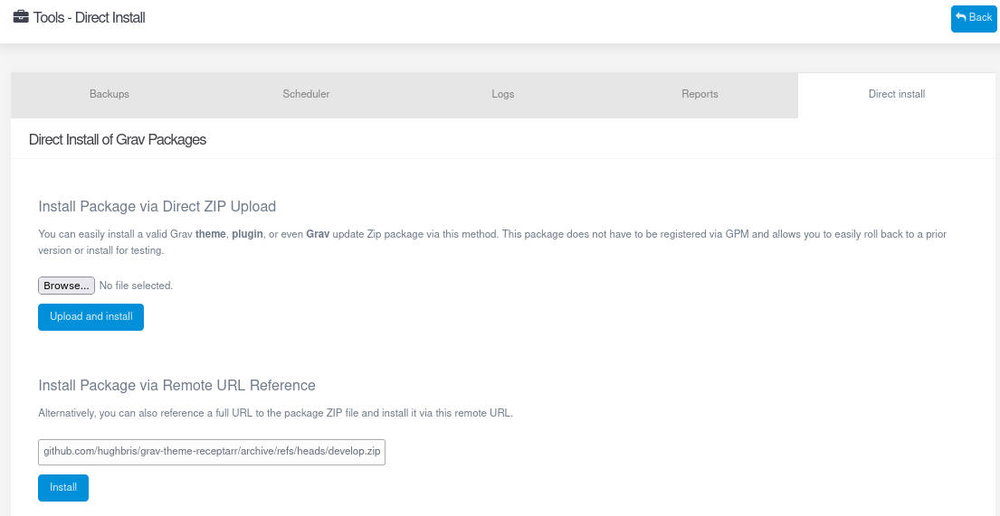
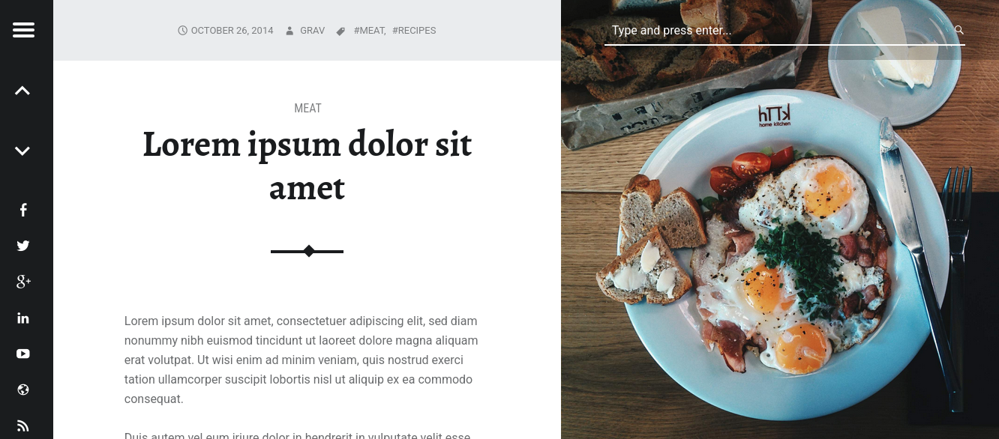
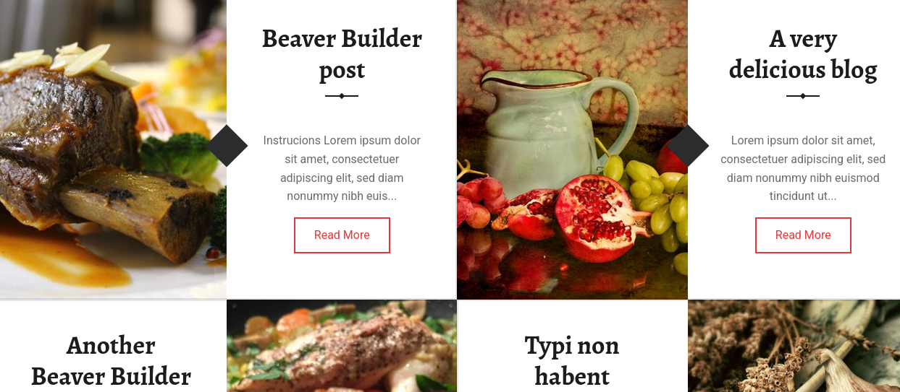

# Receptarr Theme for Grav


Receptarr is an adpatation of a self-described simple, modern, responsive, high-DPI, fully customizable, stylish blog Grav theme by [WebMan Design](http://themedemos.webmandesign.eu/).

It features split-screen book-like design inspired by a ~~modern~~ cook book with emphasis on beautiful imagery and typography.

# Features

* Navigation menu
* Split-screen book-like design
* Collapsible sidebar
* Blog Layout with support for recipes
* Beautiful imagery and typography.
* Social sharing
* Browser compatibility
* Basic translations for 14 languages

# Installation

Installing the Receptarr theme can be done in a few ways:

* [Grav Package Manager (GPM) `direct-install` options](#gpm-direct-install-options):
  * [command line version](#command-line-interface-cli);
  * [Grav Admin plugin's web interface version](#in-the-grav-admin-front-end);
* manually:
  * via [zip file](#extract-a-zip-file);
  * via [tarball](#extract-a-tarball);
  * with [`git clone`](#clone-with-git);
* [using `.dependencies`](#install-using-dependencies).

> Note that the Receptarr theme is not currently included in the official Grav theme repository, so the standard GPM `install` command _by theme name_ won't work.

## GPM direct install options

The Grav Package Manager's [`direct-install` command](#command-line-interface-cli), or its [_Direct Install_ front end](#in-the-grav-admin-front-end) in Grav Admin, provide quite a simple way to install an unlisted theme.

  > Using the direct install options for unofficial plugins and themes **will throw a security error** _unless_ you allow installing from unofficial sources in your Grav system settings. The error on the command line interface will look something like this:
  >
  ```
  Preparing to install https://github.com/hughbris/grav-theme-receptarr/archive/refs/heads/develop.zip
    |- Downloading package...     0%
    `- ERROR: Only official GPM URLs are allowed. You can modify this behavior in the System configuration.
  ```
  > The setting to modify is [`gpm.official_gpm_only` in `user/config/system.yaml`](https://learn.getgrav.org/17/basics/grav-configuration#gpm). You can also [modify the "_Official GPM Only_" setting from Grav's Admin web interface](https://learn.getgrav.org/17/admin-panel/dashboard/configuration-system#advanced) if you have system administrator permissions. **Note that this is a security setting you may want to re-enable after installing this theme.**

### Command line interface (CLI)

If you are comfortable using your system's terminal (command line), the simplest way may be to install this theme via the [Grav Package Manager (GPM)](http://learn.getgrav.org/advanced/grav-gpm) `direct-install` sub-command.

#### Variation A: by URL

From the root of your Grav install, type:

    bin/gpm direct-install https://github.com/hughbris/grav-theme-receptarr/archive/refs/heads/develop.zip

#### Variation B: download first

Find the latest release zip file at https://github.com/hughbris/grav-theme-receptarr/archive/refs/heads/develop.zip (same as Variation A above) or browse for [other versions on Github](https://github.com/hughbris/grav-theme-receptarr/releases). Download your file and place it somewhere that Grav can see.

Then in your terminal, at the root of yor Grav install, you can issue the command:

    bin/gpm direct-install ~/LOCATION-OF-ZIP-FILE/NAME-OF-ZIP-FILE.zip

---

Both variations will install the `develop` branch of Receptarr theme into your `/user/themes` directory within Grav. Its files can be found under `/your/site/grav/user/themes/receptarr`.

> If you want to install a tag release or other branch, replace the URL filename prefix with the tag or branch name, e.g. _https://github.com/hughbris/grav-theme-receptarr/archive/refs/heads/2.1.0.zip_. You can browse "releases" at https://github.com/hughbris/grav-theme-receptarr/releases. _Choose the zip file URL because it seems the tarball format is not supported by `direct-install`._

### In the Grav Admin front end

If these are true:

* you have installed Grav's Admin plugin;
* you have system administration permissions in Grav Admin;
* you prefer using graphical user interfaces over terminals.

…then you can also easily install Receptarr using the `direct-install` web front end.

Again there are two options and they mirror the two variations of the [command line version](#command-line-interface-cli) outlined above.

Once logged in, [navigate to the _Tools_ menu and then find the _Direct Install_ tab](https://learn.getgrav.org/17/admin-panel/tools).



The first option, "**Install Package via Direct ZIP Upload**", provides a front end to [Variation B](#variation-b-download-first). Here too, you just need a zip file which you can download from the same places. Then use the _Browse_ button to find and select it, and then hit the _Upload and install_ button.

The last option, "**Install Package via Remote URL Reference**" is just like [Variation A](#variation-a-by-url) above. You only need to select a URL in the same places and paste it into the text box here. Then hit the _Install_ button.

> Grav's official online manual [explains this in more detail](https://learn.getgrav.org/17/admin-panel/tools) if you need it.

## Manual Installation

### Extract a zip file

To install this theme **via zip file**, just download the [zip version of this repository](https://github.com/hughbris/grav-theme-receptarr/archive/refs/heads/develop.zip) and unzip it under `/your/site/grav/user/themes`. Then, rename the folder to `receptarr`. You can find zip files on [GitHub](https://github.com/hughbris/grav-theme-receptarr).

You should now have all the theme files under

    /your/site/grav/user/themes/receptarr

### Extract a tarball

You can also find **tarballs** by following under the [_Releases_ heading](https://github.com/hughbris/grav-theme-receptarr/releases) on Github's repository sidebar (on desktop), and then selecting a release. Then you can download it, move to your sites's `themes` directory using a command line, and issue:

```sh
mkdir receptarr && tar -zxvpf ~/LOCATION-OF-TARBALL/NAME-OF-TARBALL.tar.gz -C receptarr --strip-components=1
```

### Clone with git

You might find it easiest to **install via git**. If you are in a command line (terminal prompt) at your site's themes directory, this command should do the trick:

```sh
git clone https://github.com/hughbris/grav-theme-receptarr.git receptarr
```

> Check out a specific branch or tag using the `-b` argument, e.g. `git clone -b 2.1.0 https://github.com/hughbris/grav-theme-receptarr.git receptarr`.

## Install using `.dependencies`

Grav's command line interface `install` command will consult a YAML manifest of themes and plugins to install. You'll find Grav's default dependencies in a file called `.dependencies` in Grav's root directory. You can edit this to add more plugins and themes. This provides a few advantages:

* you can easily reconstruct your site's dependencies on a new install;
* it's possible to install plugins and themes from any git URL, they don't need to be in the official repositories;
* select a specific tag or branch of a dependency, or pin your installation to one that you know works;
* allows you to easily update and upgrade your dependencies by running the `install` command again.

The file format has some redundancy and consists of two top-level YAML properties. The convention is to list dependencies in alphabetical order but it's not necessary:

* Under `git:`, add your Receptarr repository URL and branch or tag:
  ```yaml
  git:
      …
      receptarr:
          url: https://github.com/hughbris/grav-theme-receptarr
          path: user/themes/receptarr
          branch: develop # could also be a tag like 2.2.0
      …
  ```
* Under `links:`, add some further information for the installation:
  ```yaml
  links:
      …
      receptarr:
          src: grav-theme-receptarr
          path: user/themes/receptarr
          scm: github
      …
  ```

Then in a terminal at the root of your Grav site, run this command:

```sh
bin/grav install
```

# Updating

As development for the Receptarr theme continues, new versions may become available that add additional features and functionality, improve compatibility with newer Grav releases, and generally provide a better user experience.

Unlike themes that are in [Grav's official Themes repository](https://getgrav.org/downloads/themes), almost every update method will involve deleting the old version and reinstalling Receptarr as per the [installation methods outlined above](#installation).

## Update with git

If you installed Receptarr manually using the [git clone method](#clone-with-git), you can simply move into the theme directory at the command line and issue:

```sh
git pull
```

That's it! _(\*as long as this runs smoothly)_

## Update using dependencies file

If you installed [using the `.dependencies` file](#install-using-dependencies), you can simply run through that process again. Grav's installer will check for updates in this process. **Note that all plugins and themes in this file will be updated if available**, which you may not necessarily want. If you want to only update Receptarr and not touch any other dependencies, follow the [manual update process outlined](#manual-update) here below.

> `bin/grav install` won't uninstall any plugins or themes that your remove from your dependencies file.

## Manual Update

Manually updating Receptarr is pretty simple. Here is what you will need to do to get this done:

* Delete the `your/site/user/themes/receptarr` directory.
* Follow any [installation process](#installation) outlined above.

> Note: Any changes you have made to any of the files listed under this directory will also be removed and replaced by the new set. Any files located elsewhere (for example a YAML settings file placed in `user/config/themes`) will remain intact.

# Setup

If you want to set Receptarr as the default theme, you can do so by following these steps:

* Navigate to `/your/site/grav/user/config`.
* Open the **system.yaml** file.
* Change the `theme:` setting to `theme: receptarr`.
* Save your changes.
* Clear the Grav cache. The simplest way to do this is by going to the root Grav directory in Terminal and typing `bin/grav clear-cache`.

Once this is done, you should be able to see the new theme on the frontend. Keep in mind any customizations made to the previous theme will not be reflected as all of the theme and templating information is now being pulled from the **receptarr** folder.

## Configuration

In Receptarr, you have few unique features which you can configure easily:

### Translations

Take a look at theme's **language.yaml**. Polish and English versions contains all variables which you can translate to your language.

### Adding recipes to blog page

In item.md page header you have to add something like that:

```yaml
ingredients_title: Ingredients
ingredients:
  - title: Corpus:
    list:
      - Lorem ipsum, 200g
      - Dolor sit amet 20dl
      - 80g sugar
      - 1 yolk
      - Salt
      - Water 0.5l
      - Milk 1l
  - title: Corpus:
    list:
      - Lorem ipsum, 200g
      - Dolor sit amet 20dl
      - 80g sugar
      - 1 yolk
      - Salt
      - Water 0.5l
      - Milk 1l
```

### Adding advanced description

Add code like that to page header:

```yaml
description:
  - option: Dificulty:
    value: simple
  - option: Serving:
    value: 4
  - option: Preparation time:
    value: 1 hour 30 minutes
  - option: What we need:
    value: oven, tart form, jar
```

### Adding video and SoundCloud

You have to add direct iframe url to page header. For example for Vimeo files, it's going to be:

```yaml
vimeo: https://player.vimeo.com/video/63451562?title=0&amp;byline=0&amp;portrait=0
```

### Slideshow

Add or modify this code in site.yaml:

```yaml
slider:
  - image: slide3.jpg
    title: A very delicious blog
    url: "#"
  - image: slide1.jpg
    title: Duis autem
    url: "#"
  - image: slide2.jpg
    title: Pumpkin recipe
    url: "#"
```

Slideshow images must be placed inside user theme **images/slideshow** directory.

### Featured image

Two-column, split-style pages in this theme use a bright "feature" image in one column.



For each page using a feature image, you can upload and select a feature image for that page. You can select this in Grav's Admin when editing the page, or manually in the page frontmatter like this:

```yaml
feature:
  source: FILENAME.jpg
```
The file _must be in the page folder_ with the page (i.e. _page media_). You only need to provide the file name.

**If you don't specify a feature image**, Receptarr will try to use the first image in the page folder. **If that isn't present**, Receptarr comes bundled with a global fallback image which it will use. You can change that fallback in either Grav Admin in the theme settings, or by editing your copy of Receptarr's theme configuration file by hand.

```yaml
fallback_image: MY_FALLBACK.jpg
```
Again you only need to specify the filename, but the image _must be placed_ in the theme's `images` folder.

### Blog post pages

Note that blog post grid listings use images to preview each blog post. These listings use each blog post's featured image, determined by the same rules of precedence outined above.



### Site icon ("favicon")

Your site's _favicon_ is a small, square image that was originally intended to show alongside your site title in a list of browser bookmarks. That has been expanded, and there are now any number of places where your site's favicon can appear. Most browsers show favicons on open browser tabs now, and search engines often show them next to search results. They appear in all kinds of contexts and are very important.

Favicons should be both square and small. Usually 256x256 pixels is enough.

Receptarr comes bundled with a default favicon image which you should change for your site. The setting is stored in the theme's configuration YAML file:

```yaml
favicon_image: MY_FAVICON.png
```

You only need to specify the filename, but the image _must be placed_ in the theme's `images` folder.

You can also change this setting through Grav's Admin under the Receptarr theme settings.
